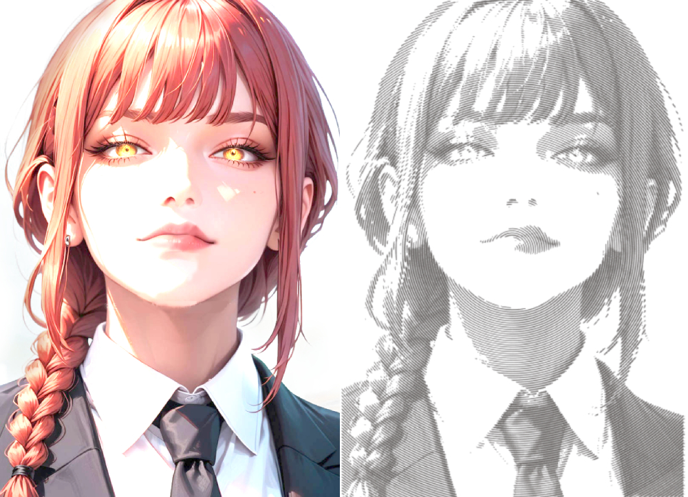
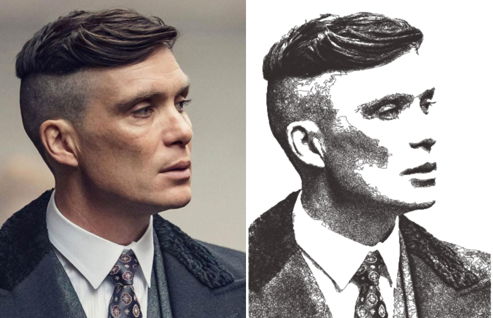

# Drawbot_image_to_svg
Spiral PFM

Original squiggle PFM


* This code is used to generate gcode for drawbots, polargraphs or other vertical drawing machines. 
* It takes an original image, manipulates it and generates a drawing path that kinda sorta looks like the original image.
* The code was intended to be heavily modified to generate different and unique drawing styles.
* Apart from the original PFM modules I added another two modules.
* Updated the original modules to increase the amount of lines (the total length would be same) to ease the postprocessing of the `SVG` file.
* I also remove the multiple pen feature since I only draw with since color. 

## Key Bindings:
| Key | Description                                        |
|-----|:---------------------------------------------------|
| p   | Load next "Path Finding Module" (PFM)              |
| r   | Rotate drawing                                     |
| [   | Zoom in                                            |
| ]   | Zoom out                                           |
| s   | Stop path finding prematurely                      |
| <   | Decrease the total number of lines drawn with 5000 |
| >   | Increase the total number of lines drawn with 5000 |
| ,   | Decrease the total number of lines drawn with 50   |
| .   | Increase the total number of lines drawn with 50   |
| i   | Save the `svg` file                                |
| 1   | load  PFM_spiral                                   |
| 2   | load  PFM_squares                                  |
| 3   | load  PFM_original                                 |
| 4   | load  PFM_triangle                                 |
| 5   | load  PFM_original2                                |
| 6   | load  PFM_squiggle                                 |

## New PFM Styles

### PFM_spiral2
Uses a **random function** to decide:
- **Amplitude of squiggle**
- **Density of squiggles**
- **Gap between two circles**

---

### PFM_triangle
 Makes **60° turns** at each squiggle, similar to `square_PFM`.

---

### PFM_squiggle
 Draws **horizontal squiggly lines**.

## Building
The SVG output location has been hardcoded to meet specific requirements.  
You should modify the following line in `Gcode.pde` to your desired location:

```java
String gname = "/home/anadi/Programs/pico/sketch/svg/" + basefile_selected + timestamp + ".svg";
```

After saving the project in `Processing` simply export the project from `files` menu.
## Running 
```java
path_to_exported_application/Drawbot_image_to_svg <path_to_image> 
```
## Issues
`OpenGL` might throw this error:
```java
java.lang.RuntimeException: Profile GL4bc is not available on ***
```

Enable `OpenGL` by this:
```java
export _JAVA_OPTIONS="-Djogl.disable.openglcore=false"`
```

## Credits
Example images are originally taken from internet and then applied the PFM(right). 